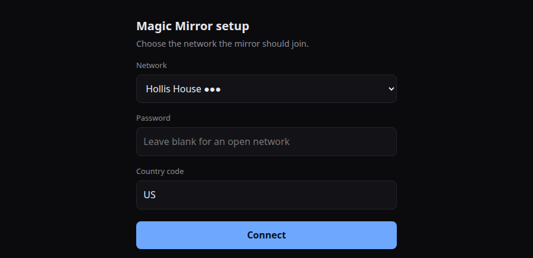
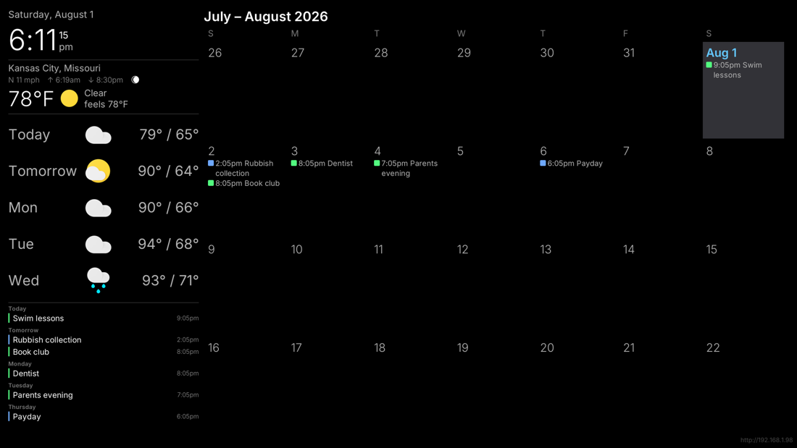
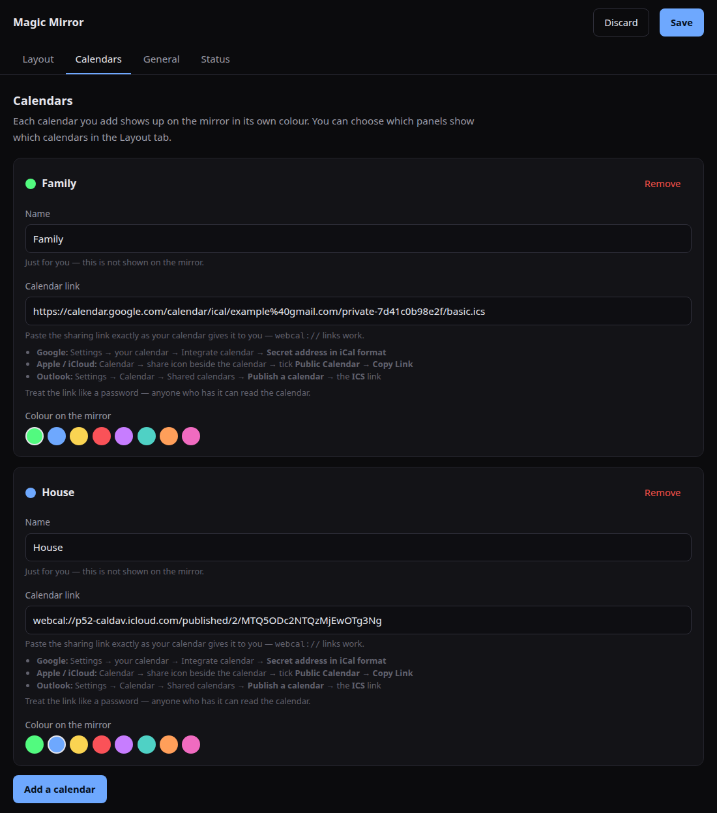
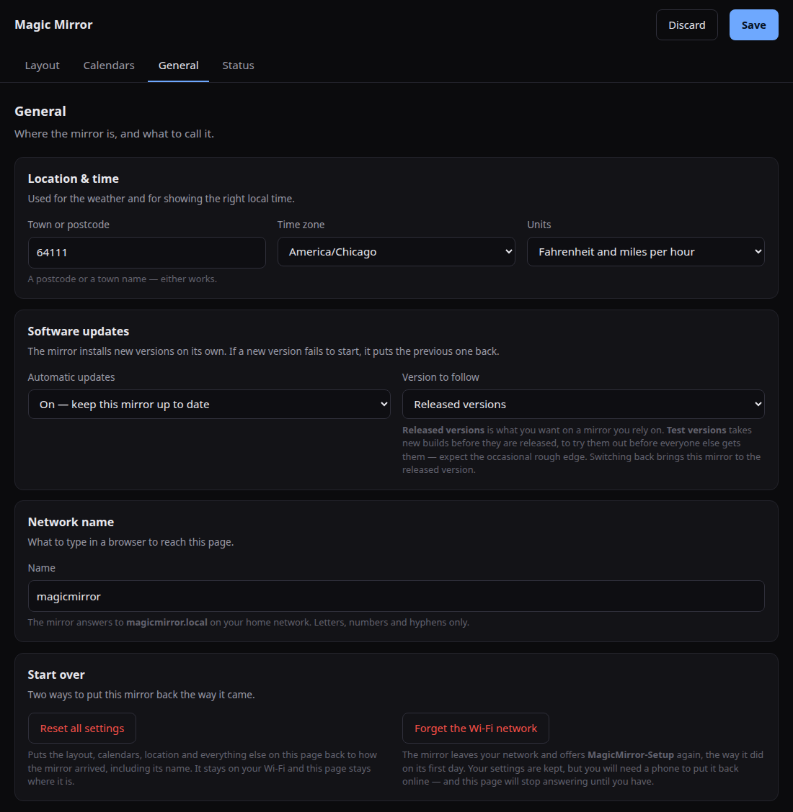
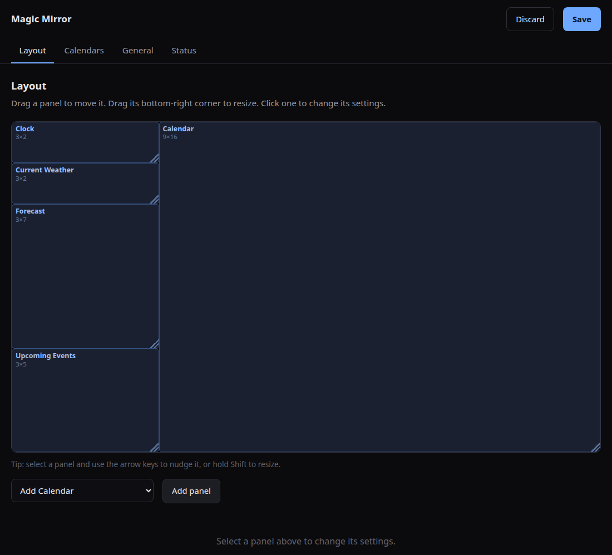
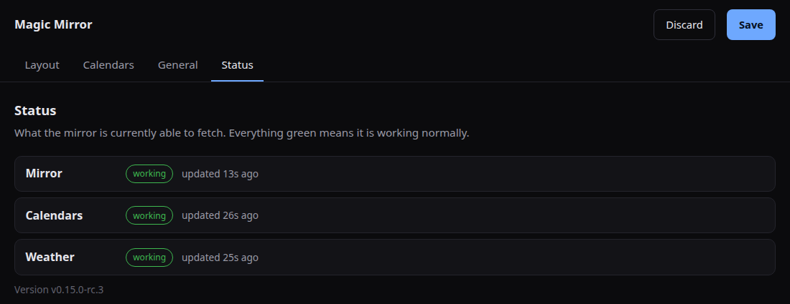

# Setting up your Magic Mirror

Everything here is done from a phone or a laptop. You will not need a keyboard,
a monitor, or a card reader.

---

## 1. Turn it on

Plug the mirror in. The first boot takes around a minute — longer than later
boots, because it is setting itself up. The screen stays dark for most of it.

You will end up at one of two places:

- **The mirror knows your Wi-Fi already.** You see the clock, weather and
  calendar. Skip to step 3.
- **The mirror has no Wi-Fi yet.** The screen tells you to join a network
  called `MagicMirror-Setup`. Carry on to step 2.

---

## 2. Put it on your Wi-Fi

The mirror makes its own temporary Wi-Fi network so you can tell it about
yours. This network only exists until the mirror is online.

1. On your phone, open Wi-Fi settings and join **`MagicMirror-Setup`**.
   There is no password.
2. A setup page should open by itself. If it does not, open a browser and go
   to **`http://192.168.4.1`**.

3. Pick your network from the **Network** list, type its password, and press
   **Connect**.

Your phone will drop off `MagicMirror-Setup` as the mirror leaves it and joins
your network instead. That is expected. Rejoin your normal Wi-Fi.

> **If your network is not in the list:** the mirror scans once, before it
> starts its own network. Hidden networks never appear. 5 GHz networks never
> appear either — this hardware is 2.4 GHz only, so pick the 2.4 GHz network if
> your router offers both.

---

## 3. Find the settings page

Once the mirror is online it prints its own web address in the bottom-right
corner of the screen, in small grey text.

Type that address into a browser on the same Wi-Fi. It will look like
`http://192.168.1.96`.

You can also try **`http://magicmirror.local`**, which is easier to remember.
It works on most computers and iPhones. Android is unreliable about `.local`
names, which is exactly why the address is printed on the screen — the numbers
always work.

The settings page has four tabs: **Layout**, **Calendars**, **General** and
**Status**. Changes are not applied until you press **Save**, and a reminder
appears next to the button whenever you have unsaved work.

---

## 4. Add your calendars

Open the **Calendars** tab and press **Add a calendar**.

Each calendar needs two things:

- **Name** — for your reference only. It is never shown on the mirror.
- **Calendar link** — the sharing link from whoever hosts your calendar.

Where to find that link:

| Provider           | Where the link is                                                                        |
| ------------------ | ---------------------------------------------------------------------------------------- |
| **Google**         | Settings → your calendar → Integrate calendar → **Secret address in iCal format**        |
| **Apple / iCloud** | Calendar → the share icon beside the calendar → tick **Public Calendar** → **Copy Link** |
| **Outlook**        | Settings → Calendar → Shared calendars → **Publish a calendar** → the **ICS** link       |

Paste the link exactly as you are given it. Links beginning `webcal://` work
as they are — there is no need to change them to `https://`.

**Colour on the mirror** is how you tell calendars apart on screen, so give
each one a different colour. Each new calendar is given an unused colour
automatically.

> **Treat these links like passwords.** Anyone who has one can read that
> calendar. Do not post them anywhere public.

Press **Save**. Events appear within a few minutes.

> **A calendar you add here goes onto the mirror on its own.** Panels showing
> every calendar pick it up as a matter of course, and panels set to show
> particular calendars have the new one added to their list for you. There is
> no second step to remember. If you would rather one panel left it out, untick
> it there — see step 6.

---

## 5. Set where you are

Open the **General** tab.

- **Town or postcode** — used for the weather forecast. A postcode or a town
  name both work.
- **Time zone** — makes the clock and your calendar events show the right
  local time.
- **Units** — Fahrenheit and miles per hour, or Celsius and kilometres per
  hour.
- **Network name** — what you type in a browser to reach this page. Changing
  it to `mirror` means the mirror answers to `mirror.local`. Letters,
  numbers and hyphens only.

**Software updates** are on by default and are best left that way. The mirror
installs new versions on its own, and if a new version fails to start it puts
the previous one back. Leave **Version to follow** on _Released versions_
unless you have been asked to test something.

Press **Save**.

---

## 6. Arrange the screen

Open the **Layout** tab. Each box is a panel on the mirror.

- **Move** a panel by dragging it.
- **Resize** it by dragging its bottom-right corner.
- **Change its settings** by clicking it — the options for that panel appear
  underneath.
- **Fine adjustments:** click a panel, then use the arrow keys to nudge it, or
  hold Shift and use the arrow keys to resize it.
- **Add** a panel by choosing a type from the dropdown and pressing
  **Add panel**. **Remove** one by selecting it and pressing **Remove panel**.

Panels that overlap are outlined in amber, with a warning underneath saying how
many. The mirror will still run — whichever panel was added later simply covers
the other — but it is usually not what you meant.

### Choosing which calendars a panel shows

Click a panel that shows events — the month grid, or an upcoming-events list —
and look for the **Calendars** setting underneath. It lists every calendar you
added in step 4, with a tickbox and a colour dot for each.

**Leave them all unticked and the panel shows everything.** That is the setting
to keep if you simply want all your calendars on the mirror, and it is the
reason a newly added calendar usually appears on its own.

**Tick specific ones and the panel shows only those.** This is how you give the
month grid every calendar while an events list beside it shows only the
children's, or put the household calendar on its own panel.

Either way, calendars you add later look after themselves: a panel showing
everything simply includes the new one, and a panel with a specific list has it
added to that list. Come here only when you want a panel to differ from the
rest — untick a calendar to drop it from this panel alone.

Unticking every box does not hide everything; it returns the panel to showing
all calendars. To leave a panel with no events at all, remove the panel.

Press **Save**. The mirror redraws immediately.

---

## 7. Check it is working

Open the **Status** tab. This is the page to look at whenever something seems
wrong.

Each row is one thing the mirror fetches, with a label saying how it is doing:

| Label                | Meaning                                                                  |
| -------------------- | ------------------------------------------------------------------------ |
| **working**          | Fetched recently. Nothing to do.                                         |
| **using older data** | The last fetch failed, so it is showing what it had. Often fixes itself. |
| **not working**      | Cannot fetch at all. The reason is printed beside it.                    |
| **waiting**          | Has not tried yet. Normal for the first minute after a restart.          |

On a healthy mirror every row says _working_. The version the mirror is running
is at the bottom of the page.

---

## Starting over

At the bottom of the **General** tab there are two buttons. Both ask before
doing anything.

**Reset all settings** puts the layout, calendars, location and everything else
back to how the mirror arrived, including its name. It stays on your Wi-Fi, and
this page stays where it is. Use this when you have made a mess of the layout
and want a clean start.

**Forget the Wi-Fi network** makes the mirror leave your network and offer
`MagicMirror-Setup` again, exactly as it did on its first day. Your settings are
kept. Use this when you move house or change your router — then go back to
step 2. You will need a phone to put it back online, and the settings page will
stop answering until you have.

---

## If something goes wrong

**The screen is blank.** Give it a full minute from power-on. If it stays dark,
unplug it and plug it back in — the mirror restarts itself if it locks up, but
only after about thirty seconds.

**The settings page will not load.** Check the address printed in the corner of
the mirror's screen; it changes if your router hands out a different one. Make
sure you are on the same Wi-Fi as the mirror. If `magicmirror.local` fails, use
the numeric address.

**Weather says "not working".** Almost always the location. Try a postcode
rather than a town name.

**A calendar says "not working".** The link has usually expired or been
regenerated. Fetch a fresh sharing link and paste it in again.

**A calendar says "working" but its events are not on screen.** It has been
unticked on the panel you are looking at. Open the Layout tab, click that
panel, and check its **Calendars** setting (step 6).

**The mirror shows old information.** Look at the Status tab. _Using older
data_ means it cannot reach the internet at the moment — check your router
before anything else.

**It dropped off Wi-Fi and did not come back.** The mirror tries to recover on
its own, escalating over several minutes and restarting itself as a last
resort. Give it five minutes before intervening. If it still cannot get on,
it puts up `MagicMirror-Setup` again so you can redo step 2.
